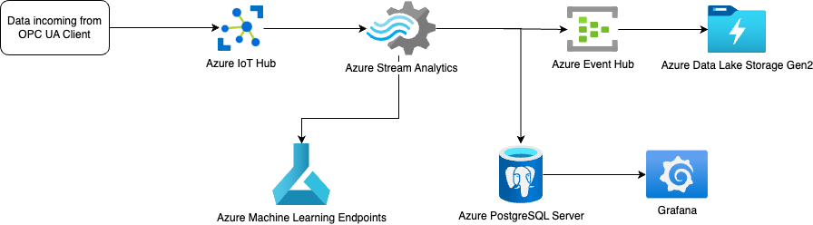

# cobot-infrastructure

This repository contains code that is needed for deployment of Cloud part of Cobot infrastructure, including data ingestion, Data Lake storage, Machine Learning services, Stream Analytics pipelines, and alterting and visualizations.




Below you can find step-by-step instructions for setting up the infrastructure for Cobot.

## Prerequisites

1. Terraform
2. Azure CLI
3. Access to Microsoft Azure account to which the infrastructure will be deployed

## Setup

The setup has two parts. First one, uses Terraform to setup pieces of infrastructure that were possible to setup with Terraform. In second section, there are follow up step-by-step instructions for setting up parts of infrastructure that could not be easily configured with Terraform.

Before moving forward, make sure that your `az` CLI is configured with correct subscription.

### Terraform setup

First, navigate to `infra/terraform`. If needed, adjust/override the variables within `variables.tf` file, but it is recommended to keep them as-is.

After that, you should initialize the directory by running:

```
terraform init
```

After that, you can inspect the proposed changes with:

```
terraform plan
```

As last step, you can deploy the changes with:


```
terraform apply
```


After successfull `apply`, we can move to manual setup of the rest of infrastructure


### Manual setup steps

#### PostgreSQL setup

In this section, we will go over setting up PostgreSQL instance for visualization and alerting.

In order to create the PostgreSQL instance, run the following command, replacing password:

```
az postgres server create --name cobot-postgres --resource-group CoBotResourceGroup --location ukwest --admin-user cobot --admin-password "<password>" --sku-name B_Gen5_1
```

After it is ready, we need to run migration script that will create necessary tables in the created database.

In order to do so, do the following:
1. Go to "Azure Database for PostgreSQL servers” in Azure Portal
2. Select the database created in previous step
3. Click on "Connect"
4. Select database to connect (”postgres” or other that was defined in previous step)
5. Provide password defined in previous step
6. Execute script from `migrations/cobot_agv_schema.sql`

#### Machine Learning Endpoints

In this section, we will go over setup of all needed resources for machine learning models.

First, create the environment that will be used by deployed models. In order to do so, run the following command in `infra/ml` directory.

```
az ml environment create --file environment.yml --resource-group CoBotResourceGroup --workspace-name cobotmlworkspace
```

The command should return right away, but the creation of the environment can take up to 20 minutes.

Next, we can create endpoint resources for all our models. In order to do so, run the following commands from `infra/ml/endpoints` directory:

```
az ml online-endpoint create -f wheel_endpoint.yml --resource-group CoBotResourceGroup --workspace-name cobotmlworkspace

az ml online-endpoint create -f mpc_300_endpoint.yml --resource-group CoBotResourceGroup --workspace-name cobotmlworkspace

az ml online-endpoint create -f mpc_200_endpoint.yml --resource-group CoBotResourceGroup --workspace-name cobotmlworkspace
```

After endpoints and environment are ready, it is possible to create deployments by running the following commands from `infra/ml/deployments` directory:

```
az ml online-deployment create --file wheel_deployment.yml --resource-group CoBotResourceGroup --workspace-name cobotmlworkspace —all-trafic

az ml online-deployment create --file mpc_200_deployment.yml --resource-group CoBotResourceGroup --workspace-name cobotmlworkspace —all-trafic

az ml online-deployment create --file mpc_300_deployment.yml --resource-group CoBotResourceGroup --workspace-name cobotmlworkspace —all-trafic
```

#### Azure Stream Analytics adjustments

Unfortunately, a lot of Stream Analytics configurations are currently not supported by Terraform (or even by `az` CLI tool), that's why it is needed to do that setup in manual manner.

As the first step, we will ensure that all created jobs are using newest pricing model which is not available via Terraform. In order to switch, go to each of the jobs in Azure Portal and reconfigure them to use `Standard V2` pricing model, with `1/3` of streaming units (that should be converted automatically).

Next, we will ensure that all jobs have `cobotStreamOutputPostgres` defined.

For `cobotWheelPredictionStreamJob`, do the following:

1. Go to Outputs
2. Add output (PostgreSQL)
3. Use alias “cobotStreamOutputPostgres”
4. Select “cobot-postgres” (or other name under which you created the database)
5. Select “postgres” database (or other database you created and ran migrations against)
6. Use “agv_wheel_anomaly” as Table
7. Provide username “cobot” (or other username for the created database)
8. Provide password for selected username

For `cobotMPCPredictionStreamJob`, do the following:

1. Go to Outputs
2. Add output (PostgreSQL)
3. Use alias “cobotStreamOutputPostgres”
4. Select “cobot-postgres” (or other name under which you created the database)
5. Select “postgres” database (or other database you created and ran migrations against)
6. Use “agv_predicted_mpc” as Table
7. Provide username “cobot” (or other username for the created database)
8. Provide password for selected username

For `cobotSegmentAnomalyStreamJob`, do the following:

1. Go to Outputs
2. Add output (PostgreSQL)
3. Use alias “cobotStreamOutputPostgres” 
4. Select “cobot-postgres” (or other name under which you created the database)
5. Select “postgres” database (or other database you created and ran migrations against)
6. Use “agv_segment_anomaly” as Table
7. Provide username “cobot” (or other username for the created database)
8. Provide password for selected username

For `cobotForwardStreamJob`, do the following:

1. Go to Outputs
2. Add output (PostgreSQL)
3. Use alias “cobotStreamOutputPostgres” 
4. Select “cobot-postgres” (or other name under which you created the database)
5. Select “postgres” database (or other database you created and ran migrations against)
6. Use “agv_data” as Table
7. Provide username “cobot” (or other username for the created database)
8. Provide password for selected username


Next, we will configure ML functions for jobs that require it.

For `cobotMPCPredictionStreamJob`, do the following:

1. Go to Functions
2. Add function (Azure ML Service)
3. Use alias “predictMPC”
4. Select Azure ML workspace `cobotmlworkspace`
5. Select deployment `mpc-200-endpoint` or `mpc-300-endpoint`
6. Set both parallel requests and batch count to 1


For `cobotWheelPredictionStreamJob`, do the following:

1. Go to Functions
2. Add function (Azure ML Service)
3. Use alias “predictWheel”
4. Select Azure ML workspace `cobotmlworkspace`
5. Select deployment `wheel-endpoint`
6. Set both parallel requests and batch count to 1


Then, we can start all of the Stream Analytics jobs by running the following commands:

```
az stream-analytics job start --resource-group CoBotResourceGroup --job-name cobotWheelPredictionStreamJob

az stream-analytics job start --resource-group CoBotResourceGroup --job-name cobotMPCPredictionStreamJob

az stream-analytics job start --resource-group CoBotResourceGroup --job-name cobotSegmentAnomalyStreamJob

az stream-analytics job start --resource-group CoBotResourceGroup --job-name cobotForwardStreamJob
```


#### Setting up Grafana

Next, we need to setup Grafana dashboards and alerts. 

1. Create a new instance on Grafana.com (or use an existing one)
2. Configure a PostgreSQL source
  - Go to Connections
  - Go to Data Sources
  - Select PostgreSQL
  - Use name “grafana-postgresql-datasource”
  - After setup, record the uid for the datasource (last part of URL, e.g. “edna15137jqiod”)
3. Replace “uid” for “datasource” in all Dashboard files to the uid of created datasource (files are available in `grafana/dashboards`)
4. Go to Dashboards
5. Import all dashboards with replaced datasource UID from grafana/dashboards
6. Unfortunately, it is not possible to import Alerts in the same manner, so they have to be recreated manually (e.g. from chart views on Dashboards to reuse already computed metric)


#### Setup Devices in IoT Hub

As the last step, you can set up devices to represent AGVs in IoT Hub.

1. Go to IoT Hub
2. Go to Devices
3. Click on Add device
4. Provide Device ID, e.g. AGV_1
5. Create device and retrieve primary connection string for further use


### Replaying data from CSV files

Inside `data` directory, there are a few sample files which contain readings that were obtained during testing runs of AGVs. Along with scripts from the `scripts`, it is possible to read the data and send them to Azure IoT Hub to trigger whole processing for stored events.

#### Prerequisites

Scripts are written in Python and require `azure-iot-device` library to be installed, e.g. with the following command:

```
pip install azure-iot-device
```

Additionally, there is a need to provide `CONNECTION_STRING` for the script (replace the value in the script) that is obtained when setting up devices in Azure IoT Hub.

#### Running the scripts

There are two separate scripts as we worked with two different AGVs that produced different readings. The first one is called `scripts/v1_replay.py` and will replay data that will be used for MPC prediction and segment anomaly predicitons. The second script is called `scripts/v2_replay.py` and will replay data that will be used for wheel anomaly predictions. To run scripts, execute the following command in the terminal:

```
python scripts/v1_replay.py
```

or

```
python scripts/v2_replay.py
```


### Reading data captured in Datalake

Data captured in Data Lake can be read for further analysis in many ways. One of the simple options to do so, is by downloading the Avro files from Datalake and analysing them locally.

#### Prerequisites

Script to read the files is written in Python and requires `avro` library to be installed, e.g. with the following command:

```
pip install avro
```

#### Running the script

The Avro files stored in Data Lake are produced by Event Hub Capture feature and they include schemas in their payload. The script `scripts/read_avro_from_datalake.py` can be used to parse such files and read them as JSON records. In order to use it, first download the file(s) from Data Lake to your local environment. Then, replace the `FILENAME` with a path to the downloaded file to be processed. After that run, the script with the following command:

```
python scripts/read_avro_from_datalake.py
```

The script will just read and print out the readings, but can be easily adjusted to do further processing on that data.
